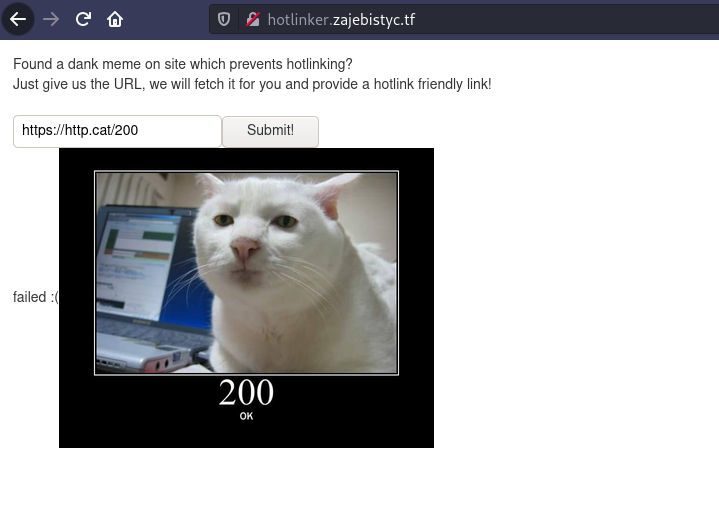
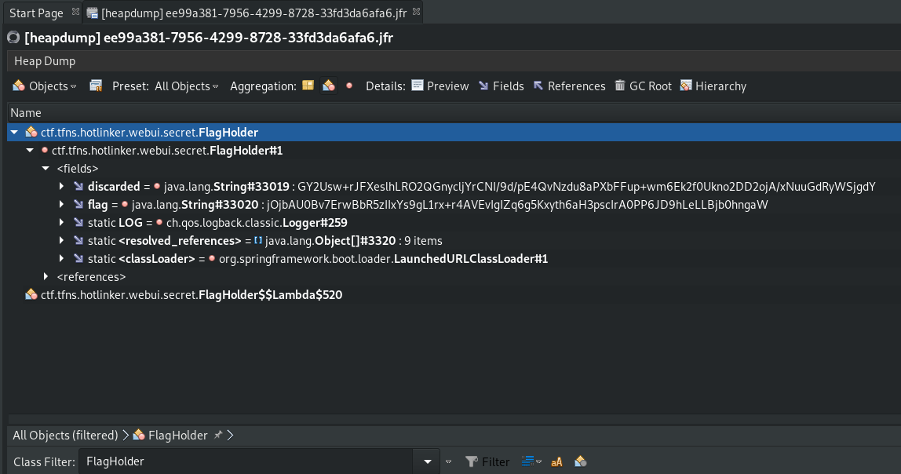

# OMH CTF 2021 - Hotlinker (web, forensic, crypto)

Solved by [Xert](https://github.com/XertDev) & [Rivit](https://github.com/rivit98n)

In this challenge, we were given an application that can download and host images for us.



Firstly, we unpacked the jar file and fed ***.class** files to decompiler. The application was written in Spring framework, so we looked at the **application.properties** file.

```
filesDir=uploads
expireTime=10
maxStoreSize=10000
maxFileSize=40000000
flag.path=flag.txt
management.endpoints.web.exposure.include=health,heapdump
management.server.port=18080
spring.freemarker.suffix=.ftl
logging.file.name=logs/hotlinker.log
logging.file.max-size=50MB
logging.file.max-history=10
server.port=8080
```

We can notice some config for management endpoints.

There were two endpoints on port 18080:

*  **/actuator/health** 
*  **/actuator/heapdump**

However, the application was hidden behind Nginx reverse-proxy and the port forwarding was enabled just for 8080 port.

Next, we checked **UploadService** class.

```java
    public Optional<UUID> uploadImage(String requestedUrl) {
        try {
            URL url = new URL(requestedUrl);
            String var10002 = url.getProtocol();
            URL hostPart = new URL(var10002 + "://" + url.getHost());
            if (this.validUrl(hostPart)) {
                try {
                    Thread.sleep(2000L);
                } catch (InterruptedException var7) {
                    var7.printStackTrace();
                }

                UUID newId = UUID.randomUUID();
                Path outPath = Paths.get(this.filesDir, newId.toString());
                InputStream content = url.openStream();
                this.copyData(content, new FileOutputStream(outPath.toFile()));
                this.files.put(newId, outPath);
                return Optional.of(newId);
            }
        } catch (MalformedURLException var8) {
            LOG.warn("Invalid URL {}", var8.getMessage());
        } catch (IOException var9) {
            LOG.warn("Error when reading from the URL {}", var9.getMessage());
        }

        return Optional.empty();
    }

    private boolean validUrl(URL hostPart) throws MalformedURLException {
        return this.validProtocol(hostPart) && this.notLocalhost(hostPart);
    }

    private boolean notLocalhost(URL hostPart) throws MalformedURLException {
        String var10003 = hostPart.getProtocol();
        return !hostPart.equals(new URL(var10003 + "://localhost"));
    }

    private boolean validProtocol(URL hostPart) {
        return hostPart.getProtocol().equals("http") || hostPart.getProtocol().equals("https");
    }
```

Method **uploadImage** checks if passed URL has a valid protocol and is not on the local machine. Next, it downloads file content for further serving. We focused on how **notLocalhost** is validating path. It's not fully secure. Passing "127.0.0.2" as the address allowed us to make request to localhost.

So, we asked the app to download **/actuator/heapdump** data and serve it for us.

Next, we analyzed heapdump using **visualvm**. We found values of **discarded** and **flag** arrays.



Now, we can start analyzing decompiled classes: **FlagHolder** and **LCG**.

```java
public class LCG {
    private final BigInteger a;
    private final BigInteger p;
    private BigInteger current;

    public LCG(BigInteger a, BigInteger p) {
        this.a = a;
        this.p = p;
        this.current = BigInteger.valueOf(Math.abs((new Random()).nextLong()));
        this.next();
    }

    public BigInteger next() {
        this.current = this.a.multiply(this.current).mod(this.p);
        return this.current;
    }
}
```

```java
public class FlagHolder {
    private static final Logger LOG = LoggerFactory.getLogger(FlagHolder.class);
    private final String flag;
    private String discarded;

    public FlagHolder(String flagPath) throws IOException {
        byte[] rawFlag = Files.readAllBytes(Paths.get(flagPath));
        byte[] flagContent = Arrays.copyOfRange(rawFlag, "flat{".length(), rawFlag.length - 1);
        this.flag = this.encryptFlag(flagContent);
        LOG.info(this.flag);
        LOG.info(this.discarded);
        this.clean(rawFlag);
        this.clean(flagContent);
        System.gc();
    }

    private String encryptFlag(byte[] rawFlag) {
        List<Byte> keystream = this.generateKeystream(rawFlag);
        List<Byte> result = new ArrayList();

        for(int i = 0; i < rawFlag.length; ++i) {
            byte x = (byte)(rawFlag[i] ^ (Byte)keystream.get(i));
            result.add(x);
        }

        return Base64.getEncoder().encodeToString(ArrayUtils.toPrimitive((Byte[])result.toArray(new Byte[0])));
    }

    private List<Byte> generateKeystream(byte[] rawFlag) {
        LCG lcg = new LCG(new BigInteger("b65ecaa9cd047b44ad4bf6d4", 16), new BigInteger("d95f16886f9b2c8d7bcdb96b", 16));
        int neededOutputs = rawFlag.length / 6 + 1;
        List<BigInteger> lcgOutputs = (List)IntStream.range(0, neededOutputs).mapToObj((idx) -> {
            return lcg.next();
        }).collect(Collectors.toList());
        List<Byte> keystream = new ArrayList();
        List<Byte> discard = new ArrayList();
        BigInteger cutoff = BigInteger.TWO.pow(48);
        Iterator var8 = lcgOutputs.iterator();

        while(var8.hasNext()) {
            BigInteger output = (BigInteger)var8.next();
            BigInteger low = output.mod(cutoff);
            BigInteger high = output.subtract(low).divide(cutoff);
            discard.addAll(this.intToBytes(high));
            keystream.addAll(this.intToBytes(low));
        }

        this.discarded = Base64.getEncoder().encodeToString(ArrayUtils.toPrimitive((Byte[])discard.toArray(new Byte[0])));
        return keystream;
    }

    private List<Byte> intToBytes(BigInteger value) {
        List<Byte> bytes = new ArrayList();

        for(int i = 0; i < 6; ++i) {
            byte b = value.mod(BigInteger.valueOf(256L)).byteValue();
            value = value.divide(BigInteger.valueOf(256L));
            bytes.add(b);
        }

        return bytes;
    }

    private void clean(byte[] buffer) {
        for(int i = 0; i < buffer.length; ++i) {
            buffer[i] = 88;
        }

    }
}
```

We can notice that the flag is xored with lower bytes of **LCG** generated numbers. Higher bytes are stored in **discarded** table. **LCG** is seeded with Random from Java which is immediately destroyed, so we cannot recover the state from its instance.

## Solution

We found interesting discussion on Crypto StackExchange.

[Problem with lll reduction on truncated lcg schemes](https://crypto.stackexchange.com/questions/37836/problem-with-lll-reduction-on-truncated-lcg-schemes)

Code attached to one of the posts was the perfect base for recovering the state of our **LCG**.

```python
#Our high bytes (higher 48 bits)
Y = [
0xab0fb3948d19000000000000,
0x4b58b2de5524000000000000,
0x9c7c1a90ed44000000000000,
0x3fd2082b3696000000000000,
0x2f8413e9dff5000000000000,
0xd7a3f16e3737000000000000,
0x26eca76e516c000000000000,
0x24457f3649e8000000000000,
0x236a0f838d9e000000000000,
0x9de1ba4dfc03000000000000,
0x58078e922547000000000000,
]

# Preparing table for equation
tab = [[0 for i in range(11)][:] for i in range(11)]
for i in range(1, 11):
    tab[i][0] = a ^ i
    tab[i][i] = -1
tab[0][0] = p
L = matrix(tab)

B = L.LLL()
W1 = B * vector(Y)
W2 = vector([ round(RR(w) / p) * p - w for w in W1 ])
Z = list(B.solve_right(W2))
print(Z)# [127691399663301, 156554482078432, 102068293686154, 184231364580831, 136813201996130, 238003269980101, 138468367323892, 252386529237825, 174646594613627, 252290595871969, 4300287015669]
```

Z list contains lower bytes of numbers generated by **LCG**.

Now there is only one step to get the flag. It's time for the final decoding script.

```python
flag = b'\x8c\xe8\xdb\x01M\x01\xbf\xb1+\xc0\x16\xd1\xe72\x08\xc5\x8b=\x80\xbdk\xc7\xea\xf8\x01Q/"\x02\x19\xab\xa89+\x1c\xad\x87\xa6\x87\xde\x9b\x1c"\xb04<\xfe\x89\x0f\xd8Kx\xb2\xc1\x8d\xbd!\x9e\x06\x96' #base64 decoded flag table
flag = list(flag)


lower = [127691399663301, 156554482078432, 102068293686154, 184231364580831, 136813201996130, 238003269980101, 138468367323892, 252386529237825, 174646594613627, 252290595871969, 4300287015669]
lower = list(map(hex, lower))
lower = list(map(lambda x: x[2:], lower))
lower= [list(reversed([x[i*2:(i+1)*2] for i in range(6)])) for x in lower]

from functools import reduce
lower = reduce(list.__add__, lower)
lower = list(map(lambda x: int(x, 16), lower))

print(lower, len(lower))

res = [a ^ b for a, b in zip(flag, lower)]

print(''.join(map(chr, res)))
#If_you_cant_make_a_hard_challenge_just_stack_multiple_layers
```


